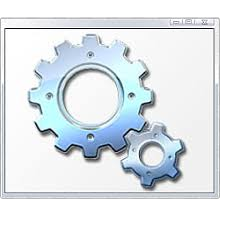

# Stalkwe

I'm Stalkwe and I'm also a young programmer. I'm still learning. My favorite programming language is <strong>Python</strong>. I'm using <em>Polybius Square</em> to encrypt text. Also I'm bad at english.

<!-- Decoration -->
---

<!-- User stats -->
#My stats

#Things that I know:
<!-- Pictures ;) -->
   <ims src="pictures/python.png" width = "50">     
I don't have normal sized Visual Basic Script icon :/
